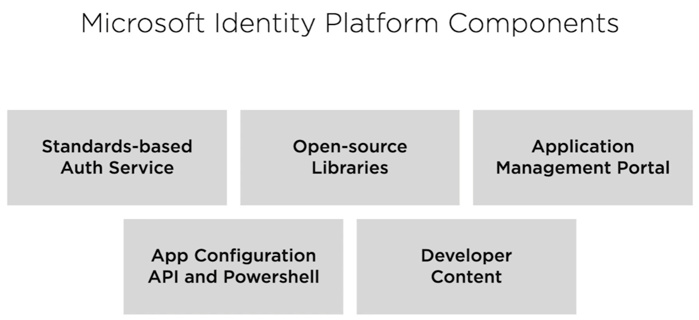
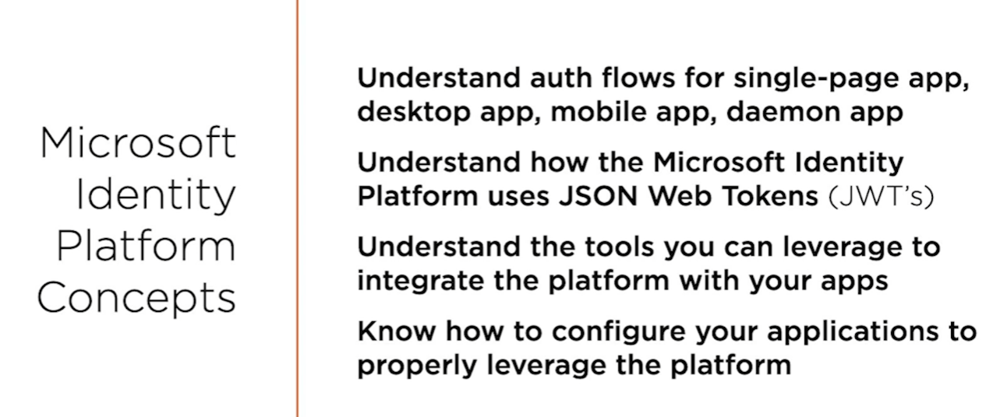
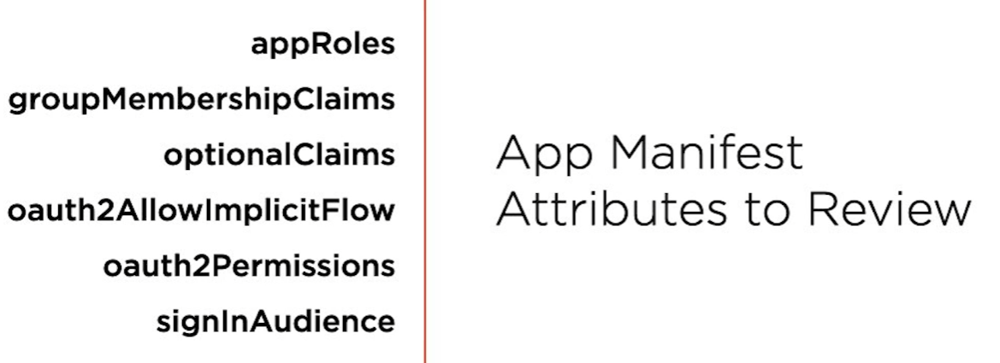

# The Microsoft Identity Platform
- The Microsoft identity platform helps you build applications your users and customers can sign in to using 
  their Microsoft identities or social accounts, and provide authorized access to your own APIs or Microsoft
  APIs like Microsoft Graph.

There are several components that make up the Microsoft identity platform:
- **OAuth 2.0 and OpenID Connect standard-compliant authentication service** enabling developers to authenticate several
  identity types, including:
  - Work or school accounts, provisioned through Azure Active Directory
  - Personal Microsoft account, like Skype, Xbox, and Outlook.com
  - Social or local accounts, by using Azure Active Directory B2C
- **Open-source libraries**: Microsoft Authentication Libraries (MSAL) and support for other standards-compliant libraries
- **Application management portal**: A registration and configuration experience in the Azure portal, along with the other
  Azure management capabilities.
- **Application configuration API and PowerShell**: Programmatic configuration of your applications through the 
  Microsoft Graph API and PowerShell, so you can automate your DevOps tasks.

## Explore service principals
- To delegate Identity and Access Management functions to Azure Active Directory, an application must be registered 
  with an Azure Active Directory tenant
- **When you register your application with Azure Active Directory, you're creating an identity configuration for your application
  that allows it to integrate with Azure Active Directory**
- When you register an app in the Azure portal, you choose whether it is:
  - Single tenant: only accessible in your tenant
  - Multi-tenant: accessible in other tenants

## Explore service principals
- If you register an application in the portal, an application object (the globally unique instance of the app) as well 
  as a service principal object are automatically created in your home tenant
- An application object is used as a template or blueprint to create one or more service principal objects
- An application object has:
  - A 1:1 relationship with the software application, and
  - A 1:many relationship with its corresponding service principal object(s).
- **A service principal is created in every tenant where the application is used**
- The application object describes three aspects of an application: 
  - how the service can issue tokens in order to access the application
  - resources that the application might need to access
  - the actions that the application can take
- ### There are three types of service principal:
  - **Application**- The type of service principal is the local representation, or application instance, of a global application 
    object in a single tenant or directory. A service principal is created in each tenant where the application is used and 
    references the globally unique app object. The service principal object defines what the app can actually do in the specific 
    tenant, who can access the app, and what resources the app can access.
  - **Managed identity** - This type of service principal is used to represent a managed identity. Managed identities provide an 
    identity for applications to use when connecting to resources that support Azure Active Directory authentication. When a 
    managed identity is enabled, a service principal representing that managed identity is created in your tenant. Service
    principals representing managed identities can be granted access and permissions, but cannot be updated or modified directly.
  - **Legacy** - This type of service principal represents a legacy app, which is an app created before app registrations were 
    introduced or an app created through legacy experiences. A legacy service principal can have credentials, service principal 
    names, reply URLs, and other properties that an authorized user can edit, but does not have an associated app registration.
    The service principal can only be used in the tenant where it was created.

## Permission types
- **Delegated permissions** are used by apps that have a signed-in user present. For these apps, either the user or an administrator
  consents to the permissions that the app requests. The app is delegated with the permission to act as a signed-in user when
  it makes calls to the target resource
- **Application permissions** are used by apps that run without a signed-in user present, for example, apps that run as 
  background services or daemons. Only an administrator can consent to application permissions

## Consent types
### Static user consent
- all the required permissions must be specified in the app's configuration in the Azure portal
- issues for developers:
  - the app needs to request all the permissions it would ever need upon the user's first sign-in. This can lead to a long 
    list of permissions that discourages end users from approving the app's access on initial sign-in
  - the app needs to know all the resources it would ever access ahead of time. It is difficult to create apps that could
    access an arbitrary number of resources
### Incremental and dynamic user consent
- incremental, or dynamic consent, only applies to delegated permissions and not to application permissions
- you can ask for a minimum set of permissions upfront and request more over time as the customer uses additional app feature
- to do so, you can specify the scopes your app needs at any time by including the new scopes in the scope parameter when
  requesting an access token - without the need to pre-define them in the application registration information
- if the user hasn't yet consented to new scopes added to the request, they'll be prompted to consent only to the new permissions
### Admin consent
- admin consent is required when your app needs access to certain high-privilege permissions

## Explore the Microsoft Authentication Library
MSAL gives you many ways to get tokens, with a consistent API for a number of platforms. Using MSAL provides the 
following benefits:
- No need to directly use the OAuth libraries or code against the protocol in your application
- Acquires tokens on behalf of a user or on behalf of an application (when applicable to the platform)
- Maintains a token cache and refreshes tokens for you when they are close to expire. You don't need to handle token 
  expiration on your own
- Helps you specify which audience you want your application to sign in
- Helps you set up your application from configuration files
- Helps you troubleshoot your app by exposing actionable exceptions, logging, and telemetry

The demo project has been copied from [Azure GitHub repo](https://github.com/Azure-Samples/ms-identity-java-spring-tutorial/tree/main/1-Authentication/sign-in)

