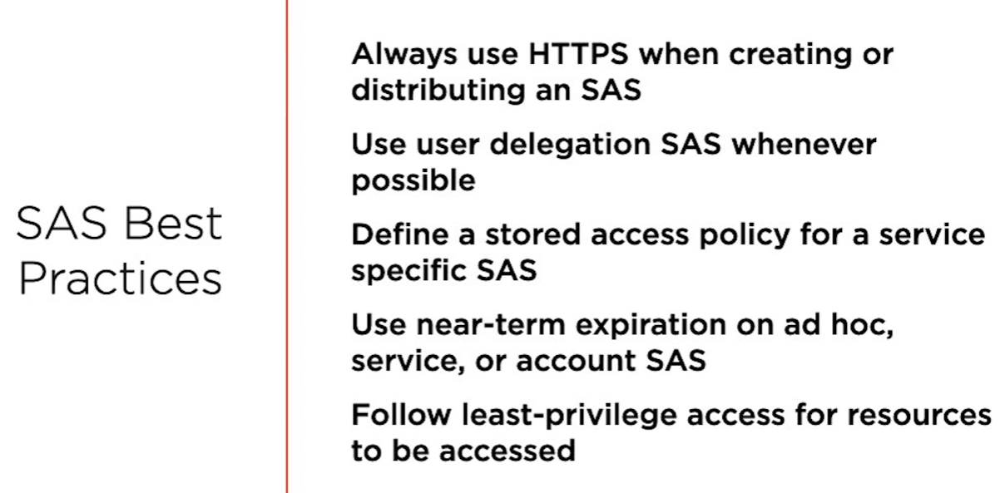

# Secure Azure Storage

## Management Plane: RBAC
- Security principal 
  - a user (somebody of something that you want to grant access to)
  - groups of users can be security principals
  - service principal
  - managed identity
- Role definition
  - can define permissions (actions, dataActions, notActions, notDataActions)
- Scope
  - the set of resources that you want to apply certain access to
  - applies on resources such as: Management group, Subscription, Resource Group, Resource (e.g. Storage account)
- ### Role assignment
  - Attach a **role definition** to a **security principal** on a **scope**
  - multiple role assignments are additive
  - deny assignments can block access and take precedence over everything else

## Data Plane
- 3 ways to secure access to Azure Storage when the data plane is concerned
  - Keys - for a new storage account 2 256 account storage keys are generated; MS recommends using keyVault
  - Shared Access Signature - built on top of Keys
  - Azure AD - using OID mechanism (access tokens)

## Shared Access Signature (SAS)
- secure, delegated access, without sharing the key
- control what the clients access, for how long, etc...
- ### 3 types of SAS tokens, based on the scope level of the delegation:
  - **User delegation SAS** 
    - when using Azure AD, with specific scope `User impersonation`
    - a user delegation SAS applies to Blob storage only
  - **Service SAS**
    - delegates access to a resource in only one Azure storage services (Blob, File, Queue or Table)
  - **Account SAS** 
    - delegates access to a resource in one or more of the Azure storage services

**_Microsoft recommends that you use Azure Active Directory credentials when possible as a security best practice, 
rather than using the account key, which can be more easily compromised. When your application design requires shared 
access signatures for access to Blob storage, use Azure Active Directory credentials to create a user delegation SAS 
when possible for superior security_**

**_The most flexible and secure way to use a service or account SAS is to associate the SAS tokens with a stored access policy._**

- ### 2 types of SAS tokens, based on its content
  - **Ad-Hoc**
    - all the information is present on the token itself
    - the token can be easily generated in the portal
  - **Service SAS**generated
    - contains a reference to the Stored Access Policy
    - the policy would contain the data that is present in the Ad-Hoc token 
    - the token itself can be viewed more like an opaque token, that just references the policy
    - this way, the policy can be shared between multiple services
    - **_the policy can be easily generated in the portal, but I found no way to generate the SAS token based on the policy,
      in the portal. The only solution I found without using a CLI (also based on the [documentation](https://docs.microsoft.com/en-us/azure/cognitive-services/translator/document-translation/create-sas-tokens?tabs=Containers) ) 
      is to use the Microsoft Azure Storage Explorer_**
    - When you establish a stored access policy on a container, table, queue, or share, it may take up to 30 seconds to take effect
    

In both cases the signature:
  - is unique string constructed from the fields that must be verified for authorizations
  - has exactly the same role as the JWT signature

A common scenario where a SAS is useful is a service where users read and write their own data to your storage account. 
In a scenario where a storage account stores user data, there are two typical design patterns:
- Clients upload and download data via a front-end proxy service, which performs authentication. This front-end proxy 
  service has the advantage of allowing validation of business rules, but for large amounts of data or high-volume 
  transactions, creating a service that can scale to match demand may be expensive or difficult.
- A lightweight service authenticates the client as needed and then generates a SAS. Once the client application receives
  the SAS, they can access storage account resources directly with the permissions defined by the SAS and for the interval
  allowed by the SAS. The SAS mitigates the need for routing all data through the front-end proxy service.

Additionally, a SAS is required to authorize access to the source object in a copy operation in certain scenarios:
- When you copy a blob to another blob that resides in a different storage account, you must use a SAS to authorize access
  to the source blob. You can optionally use a SAS to authorize access to the destination blob as well
- When you copy a file to another file that resides in a different storage account, you must use a SAS to authorize access 
  to the source file. You can optionally use a SAS to authorize access to the destination file as well
- When you copy a blob to a file, or a file to a blob, you must use a SAS to authorize access to the source object, even 
  if the source and destination objects reside within the same storage account.

