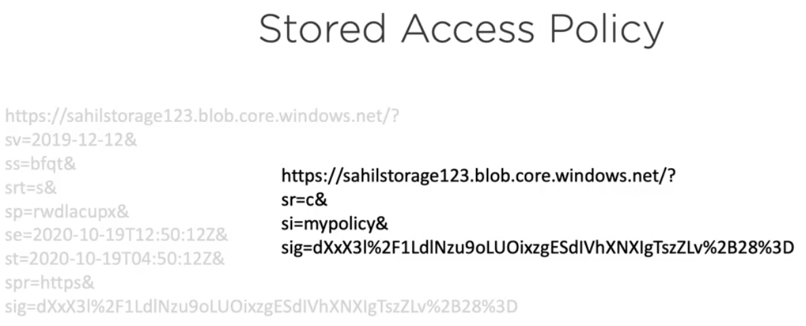

# Secure Azure Storage

## Management Plane: RBAC
- Security principal 
  - a user (somebody of something that you want to grant access to)
  - groups of users can be security principals
  - service principal
  - managed identity
- Role definition
  - can define permissions (actions, dataActions, notActions, notDataActions)
- Scope
  - the set of resources that you want to apply certain access to
  - applies on resources such as: Management group, Subscription, Resource Group, Resource (e.g. Storage account)
- ### Role assignment
  - Attach a **role definition** to a **security principal** on a **scope**
  - multiple role assignments are additive
  - deny assignments can block access and take precedence over everything else

## Data Plane
- 3 ways to secure access to Azure Storage when the data plane is concerned
  - Keys - for a new storage account 2 256 account storage keys are generated; MS recommends using keyVault
  - Shared Access Signature - built on top of Keys
  - Azure AD - using OID mechanism (access tokens)

## Shared Access Signature (SAS)
- secure, delegated access, without sharing the key
- control what the clients access, for how long, etc...
- ### 3 types of SAS tokens, based on the scope level of the delegation:
  - **User delegation SAS** 
    - when using Azure AD, with specific scope `User impersonation`
  - **Service SAS**
    - delegates access to a resource in only one Azure storage services (Blob, File, Queue or Table)
  - **Account SAS** 
    - delegates access to a resource in one or more of the Azure storage services
- ### 2 types of SAS tokens, based on its content
  - **Ad-Hoc**
    - all the information is present on the token itself
    - the token can ve easily  in the portal
  - **Service SAS**generated
    - contains a reference to the Stored Access Policy
    - the policy would contain the data that is present in the Ad-Hoc token 
    - the token itself can be viewed more like an opaque token, that just references the policy
    - this way, the policy can be shared between multiple services
    - the policy can be easily generated in the portal, but I found no way to generate the SAS token based on the policy,
      in the portal. The only solution I found without using a CLI (also based on the [documentation](https://docs.microsoft.com/en-us/azure/cognitive-services/translator/document-translation/create-sas-tokens?tabs=Containers) ) 
      is to use the Microsoft Azure Storage Explorer
    

In both cases the signature:
  - is unique string constructed from the fields that must be verified for authorizations
  - has exactly the same role as the JWT signature